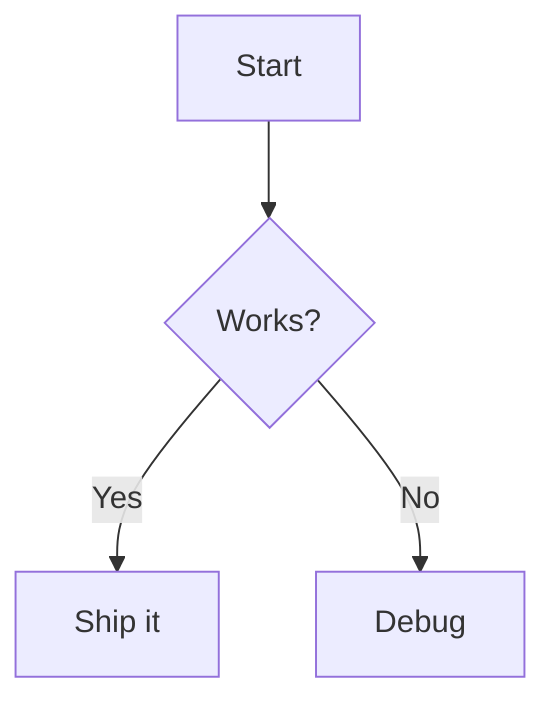

# Markdown Preview (Mermaid) Implementation Plan

> **For agentic workers:** REQUIRED SUB-SKILL: Use superpowers:subagent-driven-development (recommended) or superpowers:executing-plans to implement this plan task-by-task. Steps use checkbox (`- [ ]`) syntax for tracking.

**Goal:** Add a browser-based markdown preview (with mermaid diagram support) to the Neovim config, toggled with `<leader>mp`.

**Architecture:** A single auto-loaded file in `lua/custom/plugins/` registers `markdown-preview.nvim` via `vim.pack.add`, sets config globals before load, auto-builds its frontend assets through the `vim.pack` `User PackChanged` event (the `vim.pack` replacement for lazy's `build =` key), and binds a buffer-local toggle keymap for markdown files.

**Tech Stack:** Neovim 0.12 `vim.pack`, Lua, `iamcco/markdown-preview.nvim` (Node runtime — already installed), which-key (optional, for group label).

## Global Constraints

- Plugin management via `vim.pack.add { { src = '...' } }` — no lazy spec tables, no lockfile.
- File lives in `lua/custom/plugins/*.lua` and is auto-`require`d by the loader in `lua/custom/plugins/init.lua`; it must NOT return a spec table.
- Config globals (`vim.g.mkdp_*`) MUST be set before the plugin loads.
- Verification is manual via launching Neovim (no automated test harness in this repo).

---

### Task 1: Add markdown-preview plugin file

**Files:**
- Create: `lua/custom/plugins/markdown-preview.lua`

**Interfaces:**
- Consumes: `vim.pack.add` (Neovim builtin), `vim.fn['mkdp#util#install']` (provided by the plugin), `vim.g.mapleader` (already `<space>` in init.lua).
- Produces: command `:MarkdownPreviewToggle` (from plugin), keymap `<leader>mp`.

- [ ] **Step 1: Write the plugin file**

Create `lua/custom/plugins/markdown-preview.lua` with this exact content:

```lua
-- Browser-based markdown preview with mermaid diagram support.
-- Plugin ships frontend assets that must be built once; vim.pack has no build
-- hook, so we build via the `User PackChanged` event it fires after install/update.

-- Config globals must be set BEFORE the plugin loads.
vim.g.mkdp_auto_close = 0 -- keep the browser tab open when leaving the markdown buffer

vim.pack.add { { src = 'https://github.com/iamcco/markdown-preview.nvim' } }

-- Build the frontend assets when this plugin is installed or updated.
vim.api.nvim_create_autocmd('User', {
  pattern = 'PackChanged',
  callback = function(ev)
    local d = ev.data
    if
      d
      and d.spec
      and d.spec.name == 'markdown-preview.nvim'
      and (d.kind == 'install' or d.kind == 'update')
    then
      vim.fn['mkdp#util#install']()
    end
  end,
})

-- Buffer-local toggle keymap for markdown files.
vim.api.nvim_create_autocmd('FileType', {
  pattern = { 'markdown', 'markdown.mdx' },
  callback = function(ev)
    vim.keymap.set('n', '<leader>mp', '<cmd>MarkdownPreviewToggle<cr>', {
      buffer = ev.buf,
      desc = 'Markdown Preview (toggle)',
    })
  end,
})

-- Register the <leader>m group label with which-key if present.
local ok, wk = pcall(require, 'which-key')
if ok then
  wk.add { { '<leader>m', group = 'Markdown' } }
end
```

- [ ] **Step 2: Sync plugins so vim.pack downloads the repo and fires PackChanged**

Run:

```bash
nvim --headless "+lua vim.pack.add { { src = 'https://github.com/iamcco/markdown-preview.nvim' } }" +qa
```

Expected: command exits cleanly; the plugin is cloned into the `vim.pack` directory
(`~/.local/share/nvim/site/pack/core/opt/markdown-preview.nvim` or similar). Note:
headless `vim.pack.add` clones the repo; the PackChanged build also runs on the next
interactive launch of the config.

- [ ] **Step 3: Ensure frontend assets are built**

Run:

```bash
nvim --headless "+lua vim.fn['mkdp#util#install']()" "+sleep 8" +qa
```

Expected: exits cleanly. This downloads/builds the prebuilt frontend used to render
the preview (idempotent — safe if already built).

- [ ] **Step 4: Verify the plugin loads with no errors**

Run:

```bash
nvim --headless +"messages" +qa 2>&1 | grep -i error || echo "no errors"
```

Expected: `no errors`.

- [ ] **Step 5: Commit**

```bash
git add lua/custom/plugins/markdown-preview.lua
git commit -m "feat(markdown): add browser preview with mermaid support"
```

---

### Task 2: Manual end-to-end verification

**Files:**
- Create: `/private/tmp/claude-502/-Users-melsayed--config-nvim/b655b950-aaa6-4af5-aa0c-f5bcdd8461f9/scratchpad/mermaid-test.md` (throwaway test fixture)

**Interfaces:**
- Consumes: `<leader>mp` keymap, `:MarkdownPreviewToggle` command from Task 1.

- [ ] **Step 1: Create a test markdown file with a mermaid block**

Write to the scratchpad path above:

````markdown
# Markdown Preview Test

Some **bold** text and a list:

- one
- two


````

- [ ] **Step 2: Open it in Neovim and toggle the preview**

Run (interactive — the user performs this):

```bash
nvim /private/tmp/claude-502/-Users-melsayed--config-nvim/b655b950-aaa6-4af5-aa0c-f5bcdd8461f9/scratchpad/mermaid-test.md
```

Then in Neovim press `<leader>mp`.

Expected:
- A browser tab opens.
- The mermaid block renders as a flowchart diagram (not raw text).
- Editing the file updates the preview live.
- Switching to another buffer leaves the tab open (`mkdp_auto_close = 0`).

- [ ] **Step 3: Confirm with the user**

Ask the user to confirm the diagram rendered. If it shows as raw text, run
`:call mkdp#util#install()` in Neovim and retry (assets weren't built).

- [ ] **Step 4: Update HOTKEYS.md (if it documents leader maps)**

Check `HOTKEYS.md` for a markdown/preview section and add the `<leader>mp` entry
in the existing style. If no relevant section exists, skip.

```bash
git add HOTKEYS.md
git commit -m "docs: document <leader>mp markdown preview keymap"
```

---

## Self-Review

- **Spec coverage:** browser preview ✓ (Task 1), mermaid ✓ (Task 2 verification), Node runtime ✓ (no new dep), PackChanged build hook ✓ (Task 1 Step 1), `<leader>mp` ✓, `mkdp_auto_close = 0` ✓. All spec points covered.
- **Placeholder scan:** none — all code and commands are concrete.
- **Type consistency:** `d.spec.name == 'markdown-preview.nvim'` matches the repo's last path segment as `vim.pack` derives names; keymap and command names consistent across tasks.
